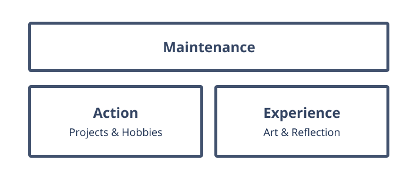

---

    title: A Framework for Organizing Your Life
    date-published: 2019-12-16T16:04
    date-created: 2017-11-04T05:27
    date: 2019-12-16T16:04
    tags:
        - lucid
    category:
        - maintenance

---

## Maintenance

Though seemingly the least exciting, Maintenance is the most important of the categories. Its value must not be understated.

Maintenance is simply any aspect of your life that directly relates to your ability to function mentally or physically. This can take many meanings, and is certainly the largest category time-wise in many people's lives. Topics include basic activities required to maintain your ideal body and mental. This can range from physical exercise to managing a career. While it's not so important that we outline a sub-framework for Maintenance here, I'll give a few example categories for the sake of clarity:

    * Health 
        * Mental – reading, journaling, meditation
        * Physical – running, sleep, diet
    * Order (aka organization)
        Physical – doing your laundry, cleaning your room
        Digital – apps, photos, file-systems, social networks
    * Money
        Bills
        Investments
        Income and Budgeting
    * Relationships

It’s easy to see how this blends into the other categories Action and Experience, and–this being a framework–it’s quite important that we make a distinction. Maintenance is where we file our thoughts, ideas, and beliefs on how we can best maintain a baseline level of clarity and comfort. Once we go beyond that, then it becomes an Action or Experience.

Running, perhaps, is good example to illustrate the difference. When we think of exercise in the sense of Maintenance, we think of the physical activity that we require to be comfortable in our body. Actions that in an ideal week of 168 hours, we should be willing to find the time for just for the sake of our mental and physical health. The mindset is for Maintenance is x hours of running is one of the most beneficial things I can do for my body, so here are the steps I will take to achieve that. On the the other hand, you have preparations for a marathon. This is not the same. The steps one must take to run a marathon are usually incredibly different than what you would consider in running for baseline health (but it doesn’t have to be!)

Another example is a person who is lucky enough to have a job or business that directly aligns with his or her passions. If one is confident that that this business will continue to sustain them, then perhaps the career subsection doesn’t exist in their Maintenance section. The business would better fit in the Action section, since, naturally, you will be inclined to take self-motivated steps to improve your business. This shouldn’t occur in a career that exists only for the sake of supporting yourself, unless you are not making enough to fit your standard of living.

Maintenance is a deeply personal idea that entirely depends on what aspects of life you value. It’s also deeply personal in the sense that we all have different capacities in regards to how much effort we are willing to put into it. Those who spend 8 hours a day in a job they hate effectively spend 40 hours on Maintenance per week plus at least another 60 on sleep and meals. Most wouldn’t see this as an ideal 168-hour week. One should always focus on minimizing Maintenance-time through efficiency and effectiveness.

## Action: Projects & Hobbies

I’m still not quite sure if “Action” is the best word to describe this section. After all, everything we do is an Action.

What’s really important is the intent. These are the things we do, more-or-less, for the sake of doing them. They can be regular or one-offs. They can take loads of effort and planning, or can be something we do when we have a few minutes before work. But I guess I don’t really need to explain what a hobby is.

What distinguishes these things from Maintenance is that they have no obligation. In a perfect world with no responsibilities, these are the things we would find ourselves doing anyway, as opposed to brushing our teeth or managing our finances. There often are no stakes involved in our participation, and if they are, they don’t matter as much as the activity itself. (If you quit your job and spend your entire life-savings to build a single startup company, that’s 100% goes in Maintenance.)

## Experience: Art & Reflection

So at first thought, this section seems quite indistinguishable from Action. The difference is subtle, but is not necessary difficult to understand.

    *Experience* – direct observation of or participation in events as a basis of knowledge 
    - Merriam-Webster

What’s important here is the point of human reflection in the events that one sees or does. What one gains, whether it be positive or negative, fleeting or life-changing, is where the importance lies.

The types of things that we can categories most easily here is art and media we have or want to appreciate. The value in a good book, movie, or music album is what we can take away from it. The are Experiences on their own, crafted by the artist.

Other appropriate subsections could be travel or concerts. Each time we repeat an event like this, it’s unlikely to be exactly the same, regardless of whether we plan it to be that way or not. This reinforces that the ideas gained in each single Experience have their own value. Compared to other ones they may be similar, but never the same.

Of course, some of the most important Experiences in our lives are outcomes of hobbies and projects. This is where the subtlety lies. What we’re creating here is a framework to categorize the knowledge we have-our thoughts, our ideas, reflections, opinions, etc. The difference between Action and Experience is that the first categorizes the knowledge it takes to do something, and the second is where we place the ideas we gain. In Action goes more practical information-resources, research, goals, processes. In Experience we put opinions and reflections on the outcome of an event. While most information of certain project may reside in Action, we put our reflection on its outcomes in Experience. 

There is one group of items that doesn’t quite fit perfectly, which is plans for the future. I toyed with having IDEAS as its own separate category, but I’m still on the fence. The solution I have come to-for now-is to place in Experience plans for events that I will attend. In Action, I will place plans for projects and hobbies that I want to do.

:::meta

It’s an odd thing. One day my mind started down the path of building a framework to view my life. It’s one of those things that I couldn’t leave alone until I had it figured out. My growing mess of notes and ideas of what I have done, am doing, and should do, was becoming a problem, and there is always the unending stream of internet that convinces me of even more things I should do. Three days and a window full of dry-erase notes later and I think I’ve got it.

In retrospect, the seed for this idea (and the inspiration for Maintenance) came to me a couple months ago after Dr. Wong’s final monologue at the end of [“Pickle Rick.”](https://en.wikipedia.org/wiki/Pickle_Rick) Just hit me at the right time, I guess.

:::

